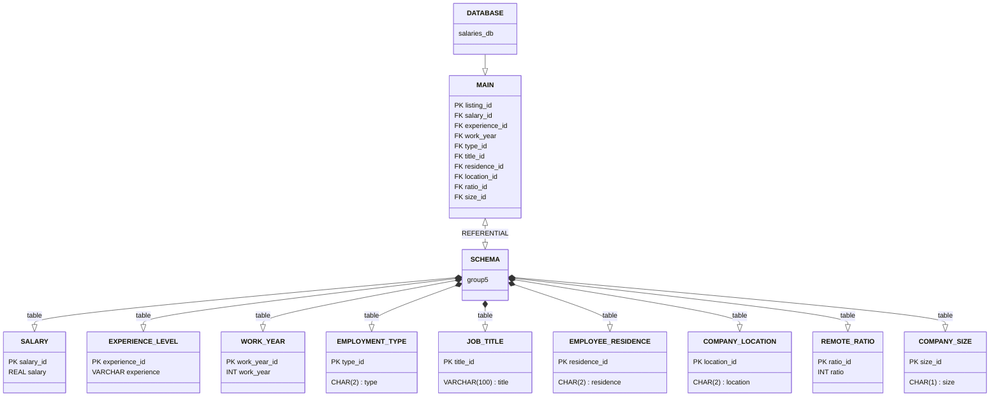

# data-science-salaries

This group project focused on building a relational database and querying the data within it using PostgreSQL.

- Authors: (Bryant Moji, Ploy Nitipiyaroj, Todd Hickam)

As part of the 'PSU CS486/586 Intro to Database Systems' the following information relates the normalization of the 'data-science-salaries-2023' data set, links to the creation of those normalized relational tables, and the queries.

All tables and queries are based on the data set found on Kaggle. Follow the link below to find the Kaggle user that compiled this data set and the original /.csv file:

- [Data Science Salaries 2023](https://www.kaggle.com/datasets/arnabchaki/data-science-salaries-2023)

## Instruction Outline for Building the Database

1. [START HERE: Create Database, Schema, and Load Salaries_Main.csv](./schema.md)
2. [Build Table: company_location](./tables/company_location.md)
3. [Build Table: company_size](./tables/company_size.md)
4. [Build Table: employee_residence](./tables/employee_residence.md)
5. [Build Table: employment_type](./tables/employment_type.md)
6. [Build Table: experience](./tables/experience.md)
7. [Build Table: job_title](./tables/job_title.md)
8. [Build Table: remote_ratio](./tables/remote_ratio.md)
9. [Build Table: salary](./tables/salary.md)
10. [Build Table: work_year](./tables/work_year.md)
11. [Build View: main_view](./tables/main_view.md)

## All SQL Files & Statement

1. [Main Table](./sql_build_files/db_main_table.sql)
2. [Company Location Table](./sql_build_files/company_location.sql)
3. [Company Size Table](./sql_build_files/company_size.sql)
4. [Employee Residence Table](./sql_build_files/employee_residence.sql)
5. [Employment Type Table](./sql_build_files/employment_type.sql)
6. [Experience Table](./sql_build_files/experience.sql)
7. [Job Title Table](./sql_build_files/job_title.sql)
8. [Remote Ratio Table](./sql_build_files/remote_ratio.sql)
9. [Salary Table](./sql_build_files/salary.sql)
10. [Work Year Table](./sql_build_files/work_year.sql)
11. [Main View](./sql_build_files/main_view_table.sql)

## MAIN DATA SET & DEFINITIONS OF COLUMNS

- [View Column Acronyms & Definitions](./definitions/TABLE_OF_DEFINITIONS.md)

We have reduced the original data set from 11 columns to 9 specific columns of interest. 

1.  work_year: The year the salary was paid.
2.  experience: The experience level in the job during the year
3.  employment_type: The type of employment for the role
4.  job_title: The role worked in during the year.
5.  salary: The total gross salary amount paid (in USD)
6.  employee_residence: Employee's primary country of residence in during the work year as an ISO 3166 country code.
7.  remote_ratio: The overall amount of work done remotely
8.  company_location: The country of the employer's main office or contracting branch
9.  company_size: The median number of people that worked for the company during the year

## DIAGRAM of DATABASE, SCHEMA, and TABLES

To view this diagram in VSCode: [ CTRL + SHFT + V ]

- [Diagram built using: Mermaid](https://mermaid.js.org/syntax/classDiagram.html)

